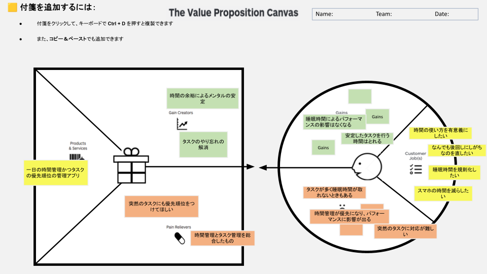

# Value Proposition Canvas v1

## 顧客像 (Customer Profile)

### 顧客の仕事 (Customer Job(s))
- 時間の使い方を有意義にしたい
- なんでも後回しにしがちなのを直したい
- 睡眠時間を規則化したい
- スマホの時間を減らしたい

### 悩み (Pains)
- タスクが多く睡眠時間が取れないときもある
- 時間管理が優先になり、パフォーマンスに影響が出る
- 突然のタスクに対応が難しい

### 理想 (Gains)
- 睡眠時間によるパフォーマンスの影響はなくなる
- 安定したタスクを行う時間はとれる

## 解決策 (Value Map)

### 製品・サービス (Products & Services)
- 一日の時間管理かつタスクの優先順位の管理アプリ

### 悩みの解消 (Pain Relievers)
- 突然のタスクにも優先順位をつけてほしい
- 時間管理とタスク管理を総合したもの

### 理想の実現 (Gain Creators)
- 時間の余裕によるメンタルの安定
- タスクのやり忘れの解消
